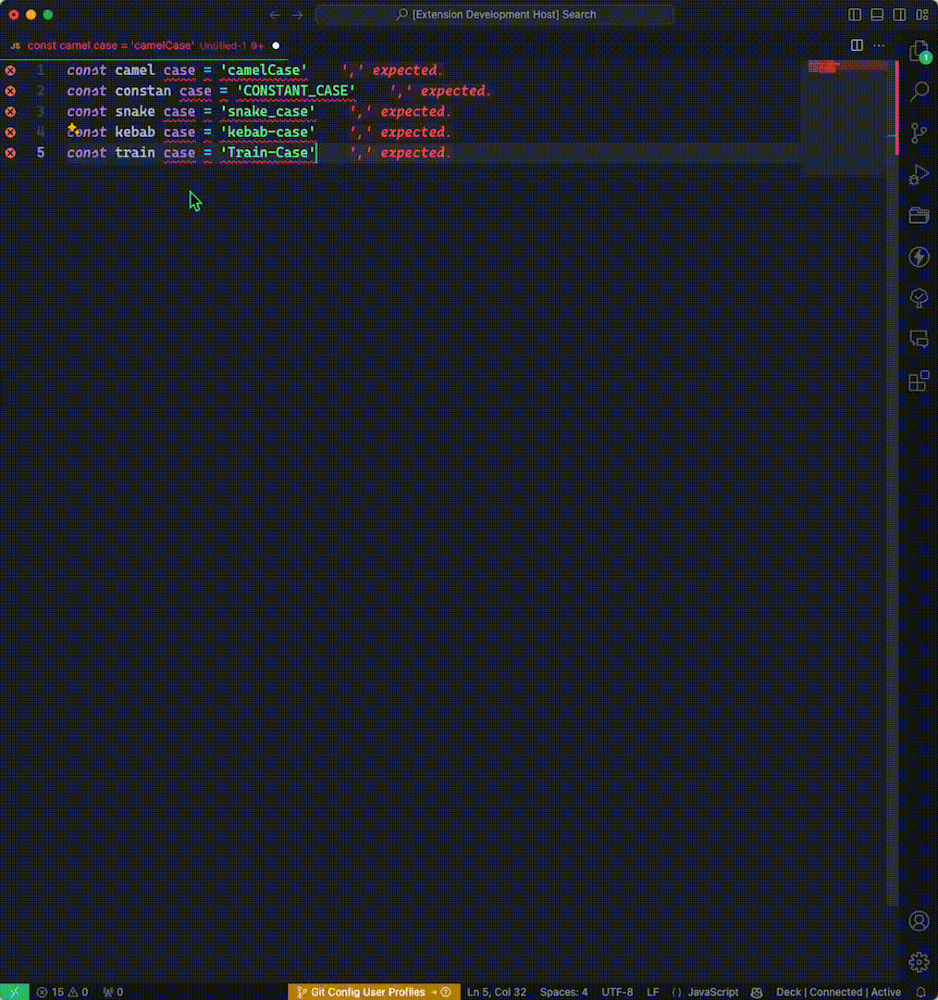

<div align="center">
  

  <h1>Format Switcher</h1>
</div>

## **Table of contents**

1. [Features](#features)

2. [Usage](#usage)

3. [Requirements](#requirements)

## Features

`Format Switcher` is a simple extension that allows you to change the formatting of selected text in the editor. The extension adds a new menu item to the context menu.

The extension supports the following cases:

```plaintext
CamelCase
snake_case
CONSTANT_CASE
kebab-case
Train-Case
```

## Usage



## Requirements

This extension uses the following libraries

```json
"lodash": "^4.17.21"
```

✨**Enjoy!**
